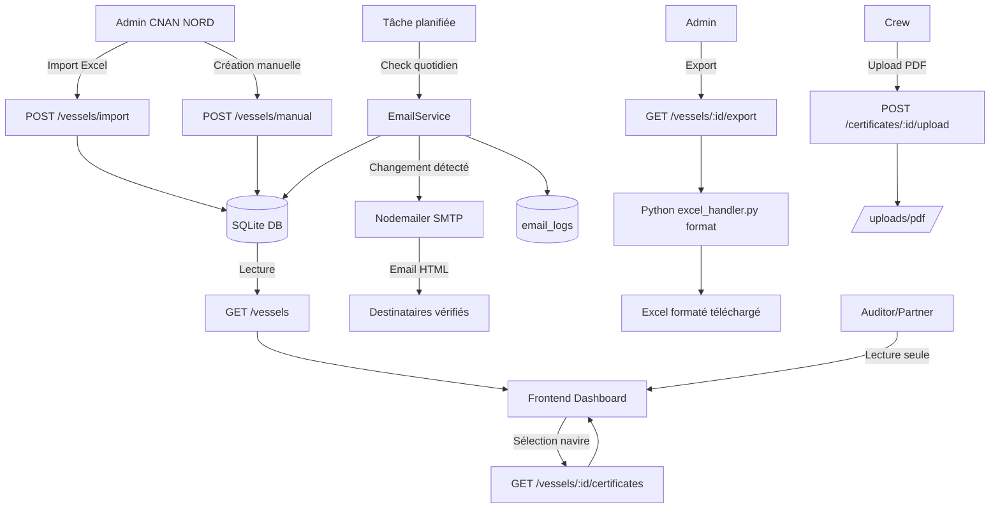

# 🚢 Analyse Complète du Projet — Portail Certificats CNAN NORD

---

## 1. Contexte Métier — Ce que fait ce logiciel

Ce logiciel est un **Portail de Suivi des Certificats & Visites de Navires** (Certificate & Survey Tracker), développé pour l'armateur algérien **CNAN NORD**, opéré techniquement par **Verital Marine Services**, et audité par **Lloyd's Register Algiers**.

Son objectif principal est de :

> **Centraliser, surveiller et alerter** sur l'état de conformité réglementaire des navires de la flotte — à savoir la validité des certificats maritimes et l'avancement des recommandations d'inspection.

---

## 2. Le Problème Métier Résolu

Dans l'industrie maritime, chaque navire doit détenir une série de **certificats légaux et de classification** (délivrés par des sociétés comme Lloyd's Register, des autorités de pavillon, etc.) qui ont des dates d'expiration précises. Ces certificats doivent être **renouvelés via des visites périodiques** (*surveys*). Un certificat expiré peut entraîner :

- ⚠️ L'immobilisation du navire dans un port (detention)
- ⚠️ Des sanctions financières et légales
- ⚠️ La perte de la couverture d'assurance P&I

Ce logiciel remplace un fichier Excel manuel (`MT_TREND_Certificate_Survey_Tracker`) par une **plateforme web multi-utilisateurs** avec alertes automatiques par email.

---

## 3. Architecture Technique

```
┌─────────────────────────────────────────────┐
│                 FRONTEND                    │
│         Next.js 14 (App Router)             │
│     TypeScript + Chart.js + Vanilla CSS     │
└────────────────────┬────────────────────────┘
                     │ HTTP REST API (JWT)
                     │
┌────────────────────▼────────────────────────┐
│                  BACKEND                    │
│            NestJS (Node.js)                 │
│  Modules: Auth, Vessels, Certificates,      │
│           Actionable, Email, Database       │
└────────┬───────────────────┬────────────────┘
         │                   │
┌────────▼──────┐   ┌────────▼──────────────┐
│  SQLite DB    │   │   Python Script       │
│  vessels.db   │   │  excel_handler.py     │
│  (node:sqlite)│   │  (openpyxl)           │
└───────────────┘   └───────────────────────┘
```

### Stack Technologique

| Couche | Technologie | Rôle |
|--------|-------------|------|
| Frontend | Next.js 14, TypeScript | Interface utilisateur SPA |
| Styling | CSS Vanilla (globals.css) | Design premium custom |
| Graphiques | Chart.js | Tableau de bord doughnut chart |
| Backend | NestJS 11 (TypeScript) | API REST + Logique métier |
| Base de données | SQLite (`node:sqlite`) | Stockage local embarqué |
| Auth | JWT + bcryptjs | Authentification sécurisée |
| Email | Nodemailer (SMTP) | Alertes automatiques |
| Script de données | Python 3 + openpyxl | Import/Export Excel |
| Scheduler | `@nestjs/schedule` | Tâches planifiées (alertes) |

---

## 4. Schéma de la Base de Données

```sql
companies          -- Armateurs, Gestionnaires techniques, Auditeurs
    └── vessels    -- Navires de la flotte
            ├── certificates       -- Certificats & Visites
            ├── actionable_items   -- Recommandations LR (Advice to Owners)
            ├── vessel_emails      -- Emails de notification (avec OTP)
            └── email_settings     -- Ancienne table emails (migrée)

users              -- Comptes utilisateurs (liés à une compagnie et/ou un navire)
email_logs         -- Journal des alertes envoyées
```

### Entités Clés

#### `vessels` — Navire
| Champ | Description |
|-------|-------------|
| `name` | Nom du navire (ex: BABOR ALGERIEN) |
| `imo_number` | Numéro IMO unique (ex: 9477189) |
| `flag` | Pavillon (ex: Algeria) |
| `asset_type` | Type (ex: Products Tanker) |
| `owner` | Propriétaire (CNAN) |
| `manager` | Gestionnaire technique (Verital Marine) |
| `gross_tonnage` | Jauge brute |
| `deadweight_tonnage` | Port en lourd (DWT) |
| `port_of_registry` | Port d'immatriculation |
| `call_sign` | Indicatif radio |
| `status` | Statut global calculé (Normal / Suivi / Attention / Imminent) |

#### `certificates` — Certificat / Visite
| Champ | Description |
|-------|-------------|
| `name` | Nom du certificat (ex: Safety Management Certificate) |
| `category` | Catégorie: `Class`, `Flag`, `Servicing` |
| `organization` | Organisme émetteur (Lloyd's Register, Algerian Flag, etc.) |
| `issuing_date` | Date d'émission |
| `expiration_date` | Date d'expiration |
| `due_date` | Date d'échéance de la prochaine visite |
| `window` | Fenêtre de renouvellement (ex: +/- 3 mois) |
| `alarm_status` | Statut d'alarme calculé (voir section 5) |
| `pdf_url` | Lien vers le scan PDF du certificat |
| `remarks` | Remarques |

#### `actionable_items` — Recommandations LR
| Champ | Description |
|-------|-------------|
| `imposed_date` | Date d'imposition de la recommandation |
| `category` | Catégorie (ex: Equipment, Safety) |
| `report_number` | Numéro du rapport d'inspection |
| `due_date` | Date limite de conformité |
| `description` | Description de l'action requise |
| `status` | Statut: `Pending` / `Resolved` |

---

## 5. Logique Métier Centrale — Le Système d'Alarme

Le cœur du système est un algorithme de calcul d'alarme basé sur le **nombre de jours restants** avant la date d'échéance ou d'expiration :

```typescript
function calculateAlarmStatus(dueDate, expirationDate) {
  const target = dueDate || expirationDate;
  const diff = (target - today) / 1 jour;

  if (diff < 0)    → "OVERDUE / IMMEDIATE"   🔴 Expiré
  if (diff ≤ 30)   → "RED - <1 MONTH"        🔴 Critique
  if (diff ≤ 90)   → "YELLOW - 1 TO 3 MONTHS" 🟡 Attention
  if (diff ≤ 180)  → "GREEN - 3 TO 6 MONTHS"  🟢 Suivi
  else             → "MONITOR >6 MONTHS"      ⚪ Normal
}
```

### Statut Global du Navire (calculé automatiquement)

| Condition | Statut Affiché | Signification |
|-----------|----------------|---------------|
| Au moins 1 certificat Rouge/Expiré | `Imminent` | Action immédiate requise |
| Au moins 1 certificat Jaune | `Attention` | Surveillance rapprochée |
| Au moins 1 certificat Vert | `Suivi` | Dans la fenêtre de suivi |
| Tous normaux | `Normal` | Conformité totale |

---

## 6. Gestion des Utilisateurs & Rôles

Le système implémente un **RBAC (Role-Based Access Control)** à 4 niveaux :

### Rôles

| Rôle | Entreprise | Accès |
|------|-----------|-------|
| **Admin** | CNAN NORD | Accès total : créer/supprimer navires, importer Excel, gérer utilisateurs, gérer emails |
| **Crew** | CNAN NORD | Accès limité à son seul navire assigné, ne peut gérer que les certificats `Servicing` |
| **Partner** | Verital Marine Services | Lecture seule — voit la flotte CNAN gérée par Verital |
| **Auditor** | Lloyd's Register Algiers | Lecture seule — voit tous les navires |

### Flux d'authentification

```
1. Login (email + password) → JWT Token (payload: id, email, role, companyId, vessel_id)
2. Premier login → must_change_password = 1 → Forçage changement de mot de passe
3. Toutes les routes API protégées par JwtAuthGuard
4. Invitation utilisateur → Email avec OTP temporaire → Changement forcé
```

---

## 7. Flux Métier Principaux

### 7.1 Import d'un Navire depuis Excel

```
Admin téléverse fichier Excel
  ↓
Backend: FileInterceptor → sauvegarde dans /uploads/
  ↓
Python Script: excel_handler.py parse <filepath>
  ↓
Lecture feuille "Certificate & Survey Tracker":
  - Lignes 2–5   → Informations navire (nom, IMO, pavillon, DWT...)
  - Lignes 9–23  → Certificats primaires (Class/Flag)
  - Lignes 27–62 → Visites périodiques (Class, Lloyd's Register)
Lecture feuille "Actionable Items":
  - Lignes 4+    → Recommandations LR (Advice to Owners)
  ↓
JSON retourné → Backend l'insère en DB
  ↓
Calcul automatique alarm_status pour chaque certificat
  ↓
Fichier uploadé supprimé après traitement
```

> [!NOTE]
> Le fichier Excel de référence `MT_TREND_Certificate_Survey_Tracker_Updated_01052026-2.xlsx` est le modèle officiel de CNAN NORD / MT Trend.

### 7.2 Export Excel d'un Navire

```
Admin demande export (GET /vessels/:id/export?lang=fr|en)
  ↓
Backend récupère en DB: navire + certificats + actionable items
  ↓
Recalcul dynamique des alarm_status à la date d'export
  ↓
Sérialisation JSON → Fichier temporaire export_{id}.json
  ↓
Python Script: excel_handler.py format <template> <output> <json>
  - Remplit les cellules du modèle Excel (B2-H5 pour le navire)
  - Applique les formules IF() Excel pour le calcul d'alarme
  - Applique les couleurs de cellule (rouge/jaune/vert/gris)
  - Supporte FR et EN (labels traduits dans le fichier)
  ↓
Fichier Excel téléchargé → Fichiers temporaires supprimés
```

### 7.3 Alertes Email Automatiques

```
[Tâche planifiée ou déclenchée manuellement via POST /trigger-notifications]
  ↓
EmailService.performCertificateStatusCheck():
  - Pour chaque navire en DB:
    - Récupère les emails vérifiés (vessel_emails WHERE is_verified=1)
    - Pour chaque certificat:
      - Calcule le nouveau alarm_status
      - Compare avec l'ancien alarm_status
      - Si changement détecté → Envoie email HTML CNAN NORD
      - Met à jour alarm_status en DB
      - Logue dans email_logs
  ↓
Résultat: { checked: N, alerts: M }
```

### 7.4 Gestion des Emails de Notification (OTP)

```
Admin ajoute email pour un navire
  ↓
Génération OTP 6 chiffres, expiration 15 min
  ↓
Email envoyé avec code de vérification
  ↓
Admin saisit le code OTP dans l'interface
  ↓
Email marqué is_verified=1 → reçoit les alertes automatiques
```

### 7.5 Upload de Certificats PDF

```
Admin/Crew téléverse PDF d'un certificat (max 10 MB)
  ↓
Stocké dans /uploads/pdf/cert-{timestamp}-{random}.pdf
  ↓
URL relative sauvegardée dans certificates.pdf_url
  ↓
Affichage PDF dans une modale viewer intégrée
```

---

## 8. Interface Utilisateur — Vues

### 8.1 Dashboard Principal
- **KPI Cards** : nombre de navires par statut (Imminent / Attention / Suivi / Normal)
- **Doughnut Chart** : répartition globale de tous les certificats par niveau d'alarme (rouge / jaune / vert / normal)
- **Sélecteur de navire** : clic pour voir les détails d'un navire spécifique
- **Panel Certificats** : tableau filtrable (par catégorie, statut, recherche texte)
  - Catégories: `Class`, `Flag`, `Servicing`
  - Actions: Éditer, Uploader PDF, Voir PDF
- **Panel Recommandations (Onglet "Recs")** : liste des actionable items LR avec statut Pending/Resolved

### 8.2 Vue Fleet
- Vue tableau de tous les navires
- Badges de compteurs (rouge/jaune/vert/normal) par navire
- Accès rapide aux actions navire (Import, Export, Paramètres email)

### 8.3 Mode TV (Affichage Mural)
- Vue plein écran conçue pour **grand écran dans une salle opérationnelle**
- Affiche en temps réel : horloge + date + liste de tous les certificats en alarme (rouge/jaune/vert)
- Auto-refresh toutes les 30 secondes
- Tri automatique par criticité (rouge > jaune > vert)
- Support FR/EN

### 8.4 Vue Logs
- Journal chronologique des emails d'alerte envoyés
- Colonnes: Navire, Certificat, Niveau d'alarme, Destinataires, Date d'envoi

### 8.5 Vue Utilisateurs (Admin uniquement)
- Liste des comptes utilisateurs
- Création d'utilisateur (rôle, compagnie, navire assigné)
- Réinitialisation de mot de passe
- Suppression d'utilisateur (avec protection: impossible de supprimer le dernier Admin)

---

## 9. Acteurs du Système et Leurs Besoins

### CNAN NORD (Armateur)
- Besoin : voir l'état de conformité de toute la flotte en un coup d'œil
- Outil : Dashboard + Mode TV + Alertes email automatiques

### Verital Marine Services (Gestionnaire Technique)
- Besoin : suivre les navires dont ils ont la gestion technique pour planifier les visites
- Outil : Accès lecture à la flotte + Export Excel formaté

### Lloyd's Register Algiers (Société de Classification / Auditeur)
- Besoin : accès en lecture pour vérifier la conformité lors des inspections
- Outil : Accès lecture complet + Vue des actionable items

### Équipage / Capitaine
- Besoin : gérer les certificats d'entretien à bord (Servicing)
- Outil : Accès limité à son seul navire + gestion des certs Servicing uniquement

---

## 10. Particularités Techniques Notables

### Utilisation de Python pour Excel
Le backend NestJS délègue le parsing et le formatage Excel à un **script Python** (`excel_handler.py`) via `child_process.exec()`. Cela permet d'utiliser la bibliothèque `openpyxl` qui gère fidèlement les modèles Excel complexes avec formules et couleurs.

### Base de données SQLite embarquée
Utilisation de `node:sqlite` (module natif Node.js 22) — pas de dépendance `better-sqlite3`. La DB est un fichier unique `vessels.db` dans le répertoire backend. Adapté pour un déploiement simple (mono-serveur).

### Calcul d'alarme multi-points
L'`alarm_status` est calculé à **3 endroits** distincts dans le code :
1. À l'import Excel (insertion initiale)
2. À la lecture de l'API (dynamiquement à chaque GET)
3. Durant le check quotidien des emails (pour détecter les changements)

> [!WARNING]
> L'`alarm_status` stocké en DB peut diverger de la valeur calculée dynamiquement. Le champ stocké sert uniquement à détecter les **changements de statut** pour les alertes.

### Internationalisation (i18n)
- Support FR / EN dans toute l'interface
- Export Excel bilingue (labels traduits dans le fichier généré)
- Emails d'alerte en français (label "CNAN NORD")

### Système OTP Double Usage
Le même pattern OTP est utilisé pour :
1. La **vérification d'email** de notification navire (6 chiffres, 15 min)
2. Les **invitations utilisateur** (6 caractères alphanumériques, mot de passe temporaire)

---

## 11. Diagram des Flux Globaux



---

## 12. Résumé Exécutif

| Aspect | Détail |
|--------|--------|
| **Domaine** | Conformité réglementaire maritime |
| **Client final** | CNAN NORD (armateur algérien) |
| **Opérateur** | Verital Marine Services |
| **Référentiel** | Lloyd's Register (société de classification) |
| **Problème résolu** | Remplacement d'un suivi Excel manuel par une plateforme web multi-utilisateurs avec alertes automatiques |
| **Entités principales** | Navires → Certificats → Alarmes → Emails |
| **Valeur métier** | Zéro retard de renouvellement, visibilité flotte en temps réel, traçabilité des alertes |
| **Architecture** | NestJS + Next.js + SQLite + Python (Excel) |
| **Déploiement** | Mono-serveur, base embarquée, prêt pour une migration cloud |
