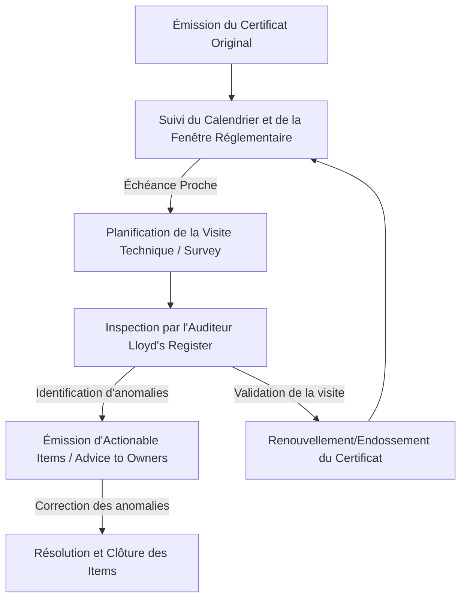

# 🚢 Étude de Cas & Analyse Métier : Portail Certificate & Survey Tracker

Cette analyse documente comment le portail de suivi des certificats a permis à **Mehdi (CEO de Verital Marine Services)** de résoudre les problèmes critiques de conformité réglementaire de la flotte maritime de **CNAN NORD**.

---

## 1. Profil du Client & Positionnement Métier

### Type de Client
**Verital Marine Services** est une entreprise de **gestion technique de navires** (ou *technical management operator*). Son rôle est d'assurer la gestion technique opérationnelle pour le compte de grands armateurs, ici l'armateur national algérien **CNAN NORD**. 

### Ce qu'il fait
En tant que gestionnaire technique, Mehdi (CEO) a la responsabilité légale, technique et commerciale de maintenir les navires de charge (tels que le cargo *MT TREND*) en parfait état de navigabilité. Son business consiste à :
*   Planifier les maintenances préventives et curatives des machines et équipements de sécurité à bord.
*   Assurer la conformité avec les conventions maritimes internationales (SOLAS, MARPOL, ISM Code).
*   Gérer les relations avec les **sociétés de classification** (comme **Lloyd's Register**) et les **autorités de pavillon** (Algerian Flag Authority).
*   Coordonner les équipes navigantes (capitaines, officiers) et sédentaires (inspecteurs techniques).

---

## 2. Le Processus Métier (Business Process)

Le business process de gestion de la conformité réglementaire des navires suit un cycle strict et régulier :

1.  **Détention des Certificats Obligatoires :** Un navire commercial ne peut pas prendre la mer sans détenir entre 40 et 60 certificats statutaires (ex. *Safety Radio*, *Load Line*, *Air Pollution Prevention*).
2.  **Surveillance des Fenêtres de Visite (*Survey Windows*) :** La validité de ces certificats est maintenue par des inspections périodiques (annuelles, intermédiaires, ou renouvellement tous les 5 ans). Ces visites doivent obligatoirement se tenir dans une **fenêtre autorisée** définie par la réglementation (par exemple, de 3 mois avant à 3 mois après la date anniversaire du certificat, ou sur des plages de dates personnalisées).
3.  **Traitement des Recommandations d'Inspection :** Lors des inspections, la Lloyd's Register peut émettre des demandes d'actions correctives (*Actionable Items*) avec une date limite d'exécution obligatoire.
4.  **Présentation des Preuves Documentaires :** À chaque arrivée dans un port international, les autorités locales (*Port State Control*) effectuent des contrôles inopinés et exigent de voir les certificats originaux en cours de validité.

---

## 3. Les Problèmes Métier Rencontrés & Leurs Coûts

### Les Dysfonctionnements Identifiés
Avant la mise en place du logiciel, le suivi reposait sur un fichier Excel manuel unique, manipulé au siège et envoyé par mail. Cette méthode présentait de graves faiblesses :
*   **Calcul manuel complexe :** Les inspecteurs techniques devaient calculer à la main les dates de début et de fin de chaque fenêtre de visite en fonction du type de certificat (annuel vs intermédiaire). Les risques d'erreurs arithmétiques étaient permanents.
*   **Manque de réactivité (Pas d'alertes) :** Aucune relance n'était générée. Si l'inspecteur oubliait d'ouvrir le fichier Excel à temps, l'échéance d'un certificat pouvait être dépassée à l'insu de la direction.
*   **Accès cloisonné aux documents originaux :** Les capitaines à bord n'avaient pas accès au fichier de suivi en temps réel. En cas d'inspection surprise au port, récupérer les scans des certificats validés prenait plusieurs heures de recherche dans les boîtes mail.
*   **Versions de fichiers contradictoires :** Multiples copies du fichier Excel circulant entre Verital, CNAN NORD et Lloyd's Register, menant à des données de conformité discordantes.

### Ce que ces Problèmes Coûtaient au Client
Une défaillance de conformité dans le secteur maritime engendre des coûts disproportionnés par rapport à l'investissement dans un outil numérique :

| Nature du Risque | Impact Opérationnel | Coût Financier Estimé |
| :--- | :--- | :--- |
| **Immobilisation du navire (Detention)** | Le navire est bloqué à quai par les inspecteurs du port jusqu'à régularisation des certificats périmés. | **20 000 $ à 50 000 $ par jour** en frais portuaires cumulés, perte d'exploitation charter, et pénalités de retard. |
| **Annulation des polices d'assurance** | En cas d'incident de navigation ou de pollution avec un certificat statutaire expiré, l'assureur P&I (Protection & Indemnity) refuse toute couverture. | **Risque de faillite directe** (responsabilité civile de plusieurs millions de dollars à la charge de Verital / CNAN). |
| **Retrait de classification (Lloyd's Register)** | Si une visite intermédiaire ou de renouvellement est manquée dans sa fenêtre de temps, Lloyd's Register suspend la classe du navire. | **Plusieurs centaines de milliers de dollars** pour organiser des audits de ré-homologation d'urgence en cale sèche. |
| **Perte de temps administratif** | Les inspecteurs techniques et officiers de liaison passaient la moitié de leur temps de travail à échanger des emails pour vérifier le statut de validité des pièces. | **Des dizaines d'heures de travail perdues** chaque semaine par collaborateur. |

---

## 4. La Solution Technologique Apportée

Pour résoudre ces problèmes, nous avons développé une application sur mesure structurée autour des besoins opérationnels de Verital :

### A. Centralisation et Rôles Sécurisés (RBAC)
Une base de données SQLite unique sécurise l'accès selon 4 profils d'utilisateurs :
*   **Admin (CNAN NORD / Verital) :** Configuration de la flotte, imports/exports globaux de rapports, gestion des comptes utilisateurs.
*   **Crew (Capitaines à bord) :** Mise à jour en temps réel des certificats d'entretien local (*Servicing*) et upload direct des scans PDF originaux depuis le navire.
*   **Partner (Verital Technical Staff) :** Lecture complète des statuts de la flotte pour la planification opérationnelle des visites.
*   **Auditor (Lloyd's Register) :** Accès de contrôle en lecture seule pour simplifier et valider les audits de conformité.

### B. Moteur d'Alarme Temporel Dynamique
Le système calcule quotidiennement la différence de jours entre la date actuelle et la date limite de la fenêtre de visite réglementaire active. Il applique des alertes visuelles segmentées et unifiées :
*   🔴 **Expiré (Overdue - Red) :** Échéance dépassée (`< 0 jours`). Nécessite un arrêt immédiat ou une dérogation.
*   🟠 **Urgent (Orange) :** Échéance critique à moins de `30 jours`. La visite doit être planifiée d'urgence.
*   🟡 **Attention (Yellow) :** Échéance entre `31 et 90 jours`. Début de planification de l'intervention de l'auditeur.
*   🟢 **Suivi (Green) :** Échéance entre `91 et 180 jours`. Surveillance standard de la fenêtre réglementaire.
*   🟣 **Conforme (Compliant - Mauve clair) :** Certificat pleinement sécurisé (`> 180 jours`).

### C. Automatisation des Alertes par Email (SMTP & OTP)
Un service d'arrière-plan surveille l'état de la flotte. Dès qu'un certificat franchit un seuil de criticité (ex: passage au statut Jaune ou Orange), un email d'alerte structuré contenant les détails du certificat et du navire est envoyé. L'inscription des emails de notification est protégée par un protocole de validation OTP (One-Time Password) à 6 chiffres pour garantir la sécurité et la validité des destinataires opérationnels.

### D. Gestionnaire de Fenêtres Multiples (Survey Window Builder)
L'interface de modification permet de configurer plusieurs fenêtres de tir d'inspection pour un même certificat (ex. *Intermediate survey*, *Annual surveys* successifs ou périodes de dates libres). Le moteur résout le calcul et cible automatiquement l'échéance de la fenêtre active la plus proche pour actualiser le statut d'alarme globale du certificat et du navire.

### E. Salle de Contrôle Murale (Mode TV)
Un mode d'affichage grand format, épuré et auto-actualisé toutes les 30 secondes, permet à Mehdi d'équiper la salle des opérations de Verital d'un écran de contrôle physique. Les alertes de toute la flotte y défilent par ordre de criticité pour un suivi visuel instantané.

---

## 5. Synthèse Métier

| Indicateur | Avant (Excel Manuel) | Après (Tracker Logiciel) |
| :--- | :--- | :--- |
| **Saisie et Synchronisation** | Saisie manuelle redondante, fichiers dupliqués par email. | Base de données centralisée unique, mise à jour à bord et visible au siège instantanément. |
| **Calcul des Échéances** | Calcul mental ou formules Excel complexes fragiles. | Résolution automatisée des fenêtres multiples et des décalages statutaires. |
| **Délai de Réaction** | Réactif (constaté après expiration). | Proactif (alertes programmées avant franchissement de seuil). |
| **Accessibilité Documentaire** | Recherche de documents PDF dans des archives locales. | Fichiers PDF rattachés et visualisables d'un simple clic. |
| **Coût Opérationnel lié au Risque** | Risque permanent de détention à 35 000 $/jour. | **Risque réduit à près de 0%.** |
