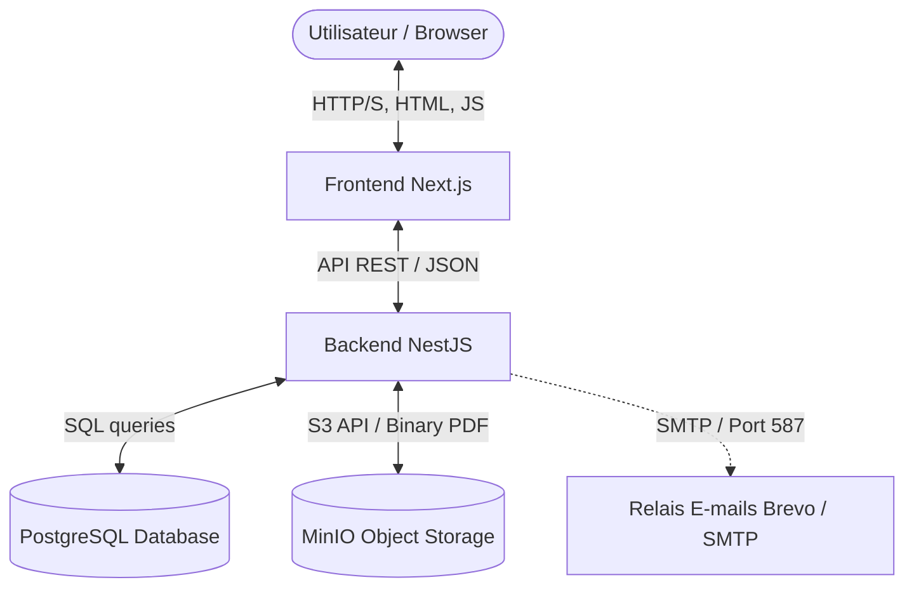

# Architecture Globale du Système

Ce document présente l'architecture globale du **Portail Certificats CNAN NORD**, l'interaction entre ses composants, et les flux de données principaux.

---

## 🏗️ Modèle Architectural Global

Le système utilise une architecture découplée moderne de type **Client-Serveur (SPA/API)** conçue pour la production.



### 1. Les Composants Principaux

*   **Le Client (Frontend Next.js)** :
    *   Application Single Page (SPA) réactive.
    *   Gère l'affichage, les interactions utilisateurs, la gestion d'état local (authentification, langue i18n), les diagrammes de conformité et l'actualisation dynamique.
*   **L'API REST (Backend NestJS)** :
    *   Point central de la logique métier.
    *   Gère la sécurité (JWT, Hashage de mots de passe, Guards de rôles), les calculs d'alarmes de certificats, la génération de rapports Excel complexes, le routage d'e-mails d'alerte, et l'intégration des systèmes d'écriture/lecture de données.
*   **La Base de Données (PostgreSQL)** :
    *   Stocke l'ensemble des données structurées : utilisateurs, entreprises, navires, certificats statutaires et d'entretien, recommandations (actionable items), configurations d'adresses e-mails et historique d'audit.
*   **Le Stockage de Fichiers (MinIO / Stockage Local)** :
    *   Fournit un stockage sécurisé et persistant pour les fichiers PDF physiques associés aux certificats maritimes. MinIO offre une API compatible S3 facilitant le passage vers le Cloud AWS S3.
*   **Le Service d'Envoi d'E-mails (Brevo / SMTP)** :
    *   Service tiers pour la distribution des notifications d'expirations et de rappels périodiques aux navires et managers.

---

## 🔐 Flux de Sécurité et Authentification

Le portail implémente une politique stricte d'authentification et d'autorisation basée sur des tokens **JWT** (JSON Web Tokens) :

1.  L'utilisateur saisit son adresse e-mail et son mot de passe sur l'interface de connexion.
2.  Le frontend envoie une requête `POST /auth/login` au backend.
3.  Le backend valide les identifiants avec un hachage cryptographique fort (`bcrypt`) sur la table `users`.
4.  En cas de succès, le backend génère un token JWT signé contenant l'ID, le rôle et les informations de l'utilisateur.
5.  Ce token JWT est retourné au frontend et stocké de manière sécurisée en mémoire (contexte React) et dans les cookies/localStorage.
6.  Pour toutes les requêtes suivantes, le frontend attache le token JWT dans l'en-tête de requête (`Authorization: Bearer <TOKEN>`).
7.  Le backend décode le token à chaque appel de route via un `JwtAuthGuard` et vérifie les autorisations de rôles grâce au `RolesGuard`.

---

## 📊 Flux de Calcul des Alarmes et Notifications

Le cœur algorithmique calcule l'état de conformité de chaque navire en temps réel :

```
[Date d'Expiration du Certificat]
            │
            ├─► > 6 mois   ──► Statut VERT
            ├─► 3 à 6 mois ──► Statut VERT (Avis de visite imminente)
            ├─► 1 à 3 mois ──► Statut ORANGE (Visite à planifier)
            ├─► < 1 mois   ──► Statut ROUGE (Urgent)
            └─► Dépassé    ──► Statut ROUGE CLIGNOTANT (Navire non conforme)
```

L'état global d'un navire est déterminé par son certificat le plus critique. Si un seul certificat du navire passe au Rouge, le navire complet est marqué en statut critique.
