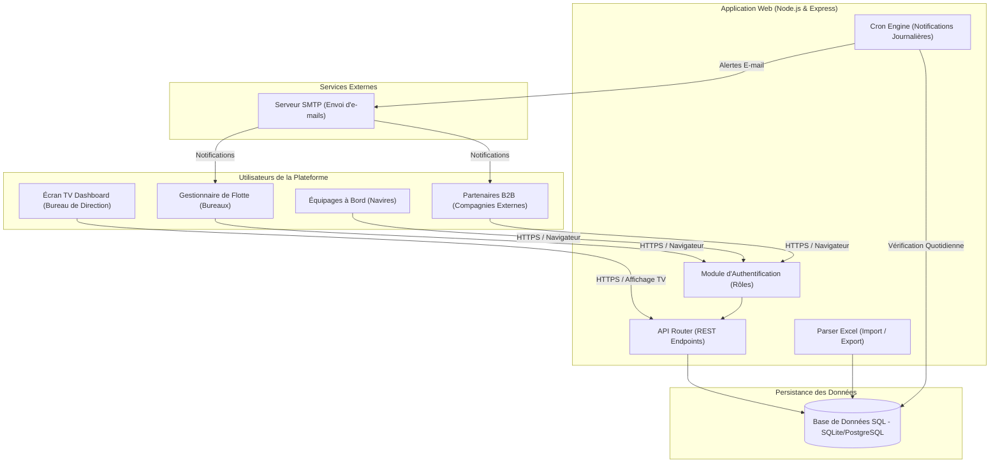
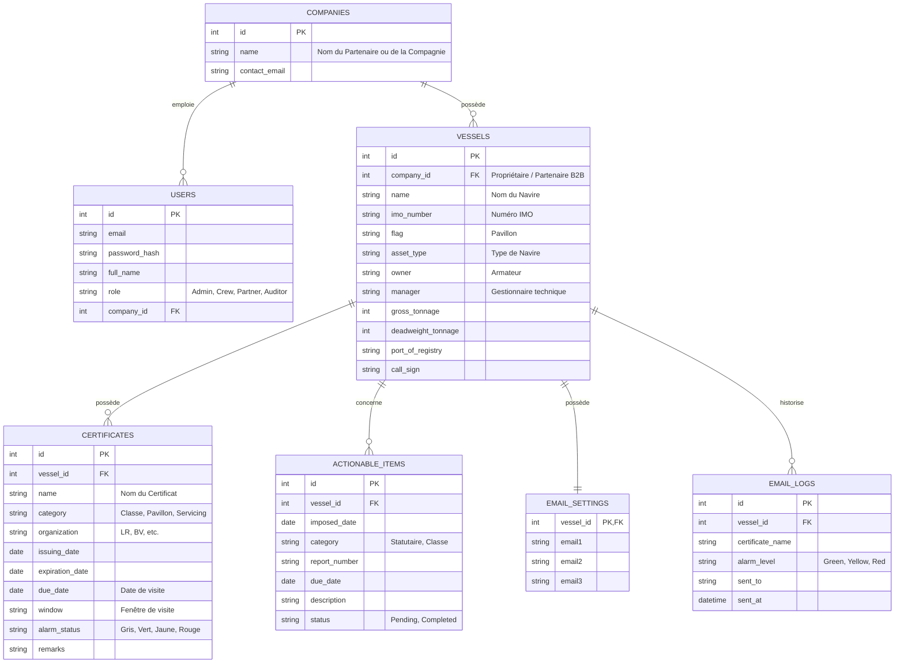
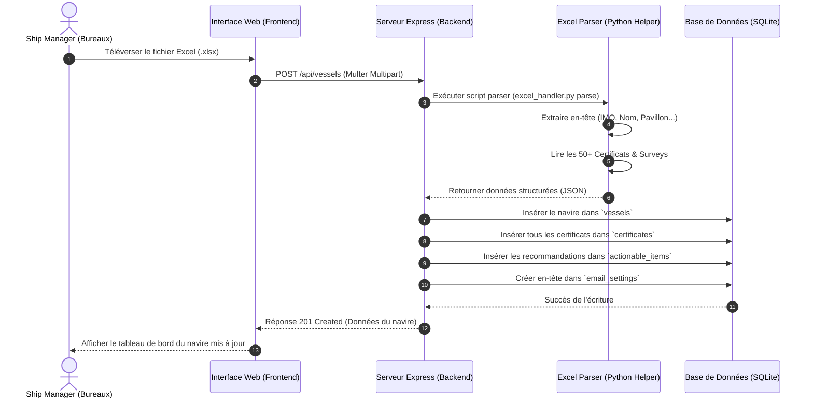
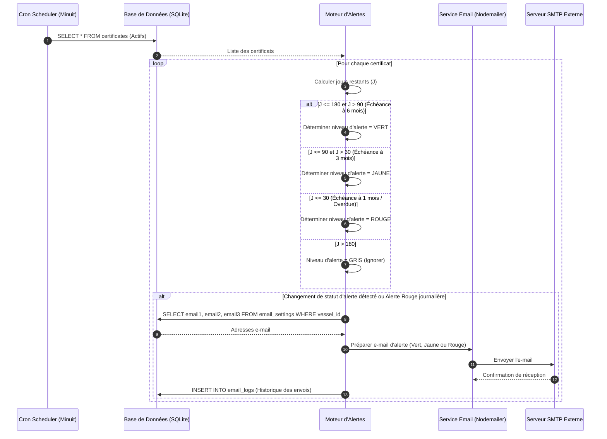
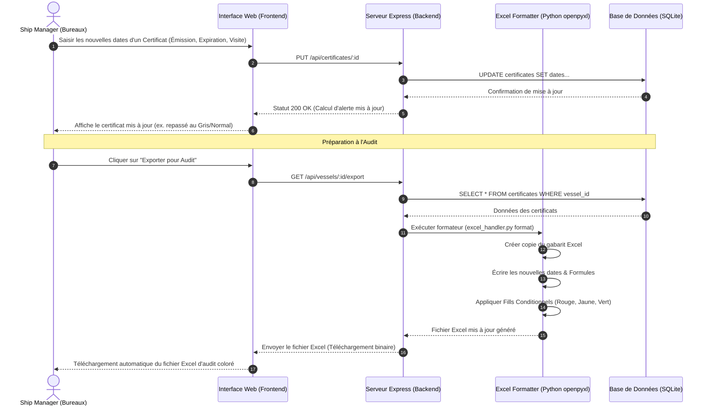

# Dossier de Présentation Fonctionnelle & Technique
## Plateforme Web de Gestion et Suivi des Certificats Maritimes

---

## 1. Introduction et Objectifs du Logiciel

La gestion de la conformité réglementaire est l’un des piliers de la sécurité et de l'exploitation commerciale des navires de commerce. Jusqu'à présent, le suivi des certificats reposait sur des fichiers Excel isolés, ce qui présentait des risques d’erreurs de saisie, de perte d’informations et d’absence d’alertes centralisées en temps réel.

Cette **plateforme web dédiée** remplace avantageusement le suivi traditionnel en introduisant un système centralisé, collaboratif et automatisé.

### Objectifs principaux du logiciel :
1. **Centraliser les données de la flotte** : Réunir l'intégralité des certificats de classe (statutaires), de pavillon et d'entretien (équipements) dans une base de données unique et sécurisée.
2. **Automatiser le suivi visuel et les alertes** : Éliminer les oublis grâce à un code couleur dynamique et des notifications par e-mail programmées (à 6 mois, 3 mois et 1 mois d'échéance).
3. **Faciliter les audits maritimes** : Fournir une interface rigoureuse et claire aux inspecteurs des affaires maritimes et des sociétés de classification lors des visites à bord ou au bureau.
4. **Permettre un affichage dynamique continu (TV de Bureau)** : Offrir aux gestionnaires et directeurs un écran de contrôle permanent pour surveiller l'état de conformité de la flotte en temps réel.
5. **Valoriser une offre B2B** : Permettre à l'entreprise de proposer ce service de gestion de flotte sous forme d'abonnement (SaaS) à des compagnies de navigation partenaires.

---

## 2. Rôles et Droits d'Accès (Multi-utilisateurs)

Pour assurer la collaboration et l’accès sécurisé des navires et des bureaux, l’application implémente **quatre rôles clés** :

1. **Administrateur / Ship Manager (Bureaux)** :
   * Accès complet à tous les navires et partenaires.
   * Importation/Exportation des certificats.
   * Modification des dates, configuration des contacts e-mail de rappel.
   * Gestion des utilisateurs.

2. **Équipage / Capitaine (Navires)** :
   * Accès restreint en lecture et mise à jour pour son propre navire uniquement.
   * Possibilité de mettre à jour les certificats d'entretien annuel (servicing) des équipements de bord après réalisation de la maintenance.

3. **Partenaire B2B (Compagnies Externes)** :
   * Accès limité en lecture seule aux navires de sa propre flotte.
   * Suivi des alertes pour ses navires.

4. **Auditeur / Inspecteur (Externe)** :
   * Accès temporaire ou restreint en lecture seule.
   * Visualisation simplifiée de l'état de conformité du navire audité et export rapide des pièces justificatives.

---

## 3. Classification et Règles de Calcul des Alertes

Le système distingue trois grandes familles de certificats maritimes :

*   **Certificats de Classe (Statutaires)** : Validité de 5 ans, rythmés par des visites annuelles ($\pm$ 3 mois de marge) et des visites intermédiaires en cale sèche / Dry-dock ($\pm$ 6 mois de marge).
*   **Certificats de Pavillon ("Flag")** : Registry, Minimum Safe Manning, Tonnage, Radio License, Polices de sécurité, etc.
*   **Certificats d'Entretien ("Servicing")** : Concerne les équipements de la passerelle et de la machine. Validité stricte de 1 an avec entretien périodique.

### Algorithme de calcul des alertes visuelles et notifications e-mail :
Soit $T$ la date d'échéance active (la date de la visite périodique ou la date d'expiration finale) et $J$ le nombre de jours restants jusqu'à cette échéance ($T - \text{Aujourd'hui}$) :

*   **Vert (Statut OK - Suffisamment de temps)** : Déclenché à **6 mois** d'échéance ($90 < J \le 180$ jours). Un premier e-mail de rappel est envoyé aux contacts configurés.
*   **Jaune (Attention - Préparation et planification)** : Déclenché à **3 mois** d'échéance ($30 < J \le 90$ jours). Un e-mail d'avertissement de planification est envoyé.
*   **Rouge (Urgence/Critique - Action immédiate)** : Déclenché à **1 mois** d'échéance ou en cas de dépassement ($J \le 30$ jours). Un e-mail de relance urgente est envoyé quotidiennement jusqu'à régularisation.
*   **Gris/Bleu (Normal - Confortable)** : Aucun risque en cours ($J > 180$ jours). Pas de notification e-mail.

---

## 4. Diagrammes d'Architecture et Modèles de Données

### A. Diagramme d'Architecture Système (Physique et Logique)
Ce diagramme illustre comment les différents types d'utilisateurs interagissent avec l'application web centralisée, sécurisée par une base de données relationnelle.



### B. Modèle Conceptuel des Données (Base de Données SQL)
Le schéma ci-dessous décrit les relations entre les tables du système, assurant une structure B2B multi-flotte solide.



---

## 5. Diagrammes de Cas d'Utilisation (Use Cases)

### A. Cas d'Utilisation : Ship Manager (Bureaux)
Le gestionnaire de flotte a le contrôle total de la configuration et de l'administration du suivi.

```mermaid
usecaseDiagram
    actor "Ship Manager (Bureaux)" as SM
    
    usecase UC1 as "Importer fichier Excel (Init)"
    usecase UC2 as "Visualiser Tableau de bord Flotte"
    usecase UC3 as "Modifier dates de Certificat"
    usecase UC4 as "Configurer adresses E-mail d'alerte"
    usecase UC5 as "Exporter rapport Excel coloré (Audits)"
    usecase UC6 as "Gérer les utilisateurs"

    SM --> UC1
    SM --> UC2
    SM --> UC3
    SM --> UC4
    SM --> UC5
    SM --> UC6
```

### B. Cas d'Utilisation : Équipage / Capitaine (À Bord)
L'équipage met à jour le statut des maintenances à bord.

```mermaid
usecaseDiagram
    actor "Équipage / Capitaine" as Crew
    
    usecase UC2 as "Visualiser Certificats du Navire"
    usecase UC3 as "Modifier dates des certificats d'entretien (Servicing)"
    usecase UC4 as "Consulter la liste des Actions à faire (Actionable Items)"

    Crew --> UC2
    Crew --> UC3
    Crew --> UC4
```

### C. Cas d'Utilisation : Partenaire B2B & Auditeur (Consultation)
Les parties prenantes externes consultent les statuts en toute transparence pour s'assurer de la conformité.

```mermaid
usecaseDiagram
    actor "Partenaire B2B / Auditeur" as Ext
    
    usecase UC1 as "Consulter Dashboard Flotte / Navire"
    usecase UC2 as "Télécharger rapport de conformité Excel"
    usecase UC3 as "Vérifier la validité des certificats"

    Ext --> UC1
    Ext --> UC2
    Ext --> UC3
```

---

## 6. Diagrammes de Séquence de la Logique Métier

### A. Importation de Données et Initialisation d'un Navire
Ce diagramme détaille les étapes lorsqu'un Manager téléverse un fichier Excel pour configurer un navire pour la première fois.



### B. Cycle Automatique d'Alertes et Notifications (Cron Job)
Ce processus s'exécute chaque nuit en tâche de fond sur le serveur pour vérifier l'état des certificats et envoyer les e-mails.



### C. Modification d'un Certificat et Exportation pour Audit
Ce processus montre comment un Manager met à jour un certificat en ligne, puis télécharge un export Excel formaté pour un audit.



---

## 7. Avantages Stratégiques et Commerciaux du Logiciel

1. **Zéro Oubli de Visite (Économies Majeures)** : Un navire dont le certificat de classe a expiré est immédiatement **immobilisé par le contrôle de l'État du port (PSC)**. L'immobilisation d'un navire de commerce coûte entre **20 000 et 50 000 USD par jour**. L'application amortit son coût de développement dès le premier oubli évité.
2. **Gain de Temps Administratif** : Les équipes techniques en bureaux n'ont plus à ouvrir et compiler des dizaines d'Excel par navire. Le dashboard regroupe toute la flotte sur un écran.
3. **Facilitation des Audits Réglementaires** : Présenter un tableau de bord moderne et interactif à un inspecteur du pavillon ou d'une société de classification témoigne d'un contrôle rigoureux de la conformité, raccourcissant le temps d'audit et limitant le risque de non-conformités majeures.
4. **Modèle de Service B2B** : L'architecture SaaS permet d'ouvrir des comptes "Partenaires" pour facturer ce service de suivi de certificats à des clients tiers (armateurs ou gestionnaires de navires partenaires), générant une source de revenus récurrents.
